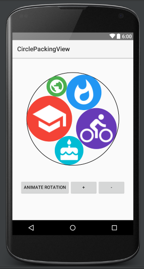

# CirclePackingView

 

In geometry, circle packing is the study of the arrangement of circles (of equal or varying sizes) on a given surface such that no overlapping occurs and so that all circles touch one another.

CirclePackingView is an Android component which implements circle packing algorithm as group of round image views. CirclePackingView can be a useful replacement for status badges and and circle image views. This repository includes the CirclePackingView component itself.

CirclePackingView uses calculations from <a href="http://www.packomania.com/" target="_blank">http://www.packomania.com/</a>

Circle packing view implements best known packings of unequal circles with radii of i^1/2, i=1,2,3,...8, in a circle (could be extended up to 100)

